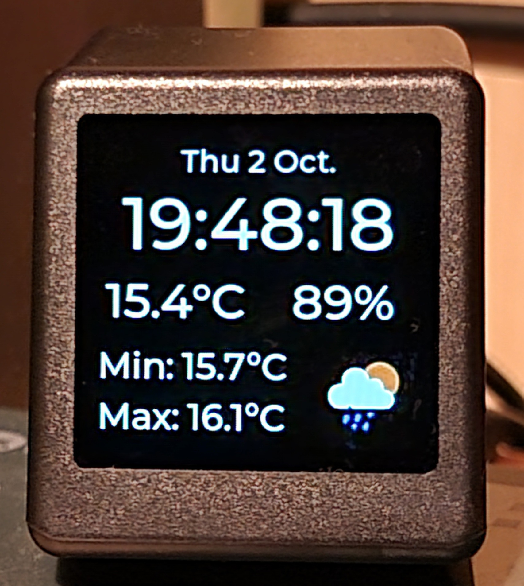

# Desk Weather Clock (GeekMagic-S3)
ESP32-S3 firmware for displaying current time, date, weather, and image notifications from other devices on a 240x240 display.

**Built for the [GeekMagic-S3](https://github.com/GeekMagicClock/GeekMagic-S3) bought from AliExpress** (based on `esp32-s3-devkitm-1` with 16MB flash, 8MB PSRAM and a 240x240 TFT display)



---

## Features

- Support for the built-in capacitive touch button on top of the chassis to toggle power
- Can display remote images by calling the `/show_image?url=<image_url>` endpoint or by POSTing images directly to `/show_image`
- Can show text messages as an overlay by calling the `/show_message?msg=<text>&duration=<time_in_ms>` endpoint
- Synchronizes its power state with your computer (remote device must call `/keepalive` endpoint at least every <5 minutes to stay on)
- Clock and weather display using OpenWeatherMap API, including temperature, humidity, min/max temperature
- Web configuration UI: WiFi, MQTT, weather API key, display settings, etc.
- Falls back to AP mode if WiFi is not configured or unavailable

## Build

This project is designed to be built using [PlatformIO](https://platformio.org/)

```
pio run -t uploadfs     # Upload SPIFFS flash image
pio run -t upload       # Upload firmware
```
### UI development

When adding or changing XML markup files in `lib/gui`, you must re-generate the C sources in that folder using LVGL-Editor or their CLI.
Do not edit the generated files directly (file name ending in `_gen`).

### Wokwi Simulator support

This project can be run in the [Wokwi simulator](https://wokwi.com/). Note that the simulator is much slower than the real hardware, so the display updates will be slow.

To run in Wokwi, build the project using PlatformIO. The build process (specifically `merge_bin.py`) will generate a merged binary image in `.pio/build/esp32-s3-devkitm-1/firmware_merged.bin`.

You can then either manually upload this binary to Wokwi together with the `wokwi.toml` and `diagram.json` files, or use Wokwi VS Code or Jetbrains CLion extension to run the simulator directly from inside your IDE (recommended).

## Acknowledgements

- [GeekMagic-S3-Frigate-Event-Viewer](https://github.com/Marijn0/GeekMagic-S3-Frigate-Event-Viewer) by [@Marijn0](https://github.com/Marijn0/) was used as a template and re-written using FreeRTOS and LVGL.
